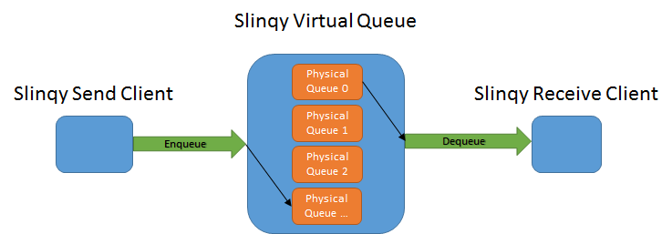

# What is Slinqy?
A tool for applications to automatically scale their queue resources at runtime based on demand.

## How it Works

Slinqy works by sitting in between your application code and your queuing infrastructure.

## Features
### Auto Expanding Storage Capacity

During normal operation, your application will process queue messages in a timely fashion.  

Unfortunately, issues can arise that prevent your back end from processing queue messages for prolonged periods of time.
Queues, high traffic queues in particular, can become full in such situations.  Either requiring frantic manual intervention or worse,
reaches full and the upstream users begin receiving errors...

Slinqy will automatically grow the storage capacity of your queue if utilization nears full so that you and your users never encounter queue full errors.

#### How it Works

A Slinqy queue is a virtual queue that can be made up of one or more physical queue shards.

Your application will only be aware of the virtual queue, the underlying physical queue shards are automatically managed by Slinqy.

Under normal circumstances, Slinqy will only use one queue shard.  But if queue storage utilization reaches or exceeds the threshold you configure then Slinqy will automatically add additional queue shards to compensate, which will be seamless to your application.

Slinqy will always send new messages to the highest physical queue shard and always read from the lowest physical queue shard in order to maintain the order of your messages.

### Not Tightly Coupled to Any Queuing Technology

The core logic of Slinqy is not written against any particular queuing technology.  This provides several benefits:

1. You won't be waiting on us to integrate the latest and greatest of your particular queuing tools in to Slinqy.
2. No waiting or being held to older versions of your queuing tools.
3. Can work with any queuing technology.

#### How it Works

Slinqy works against a set of interfaces that you implement.  Since you provide the queue technology specific implementation, it can be anything!

## How to Use Slinqy

### 1 Get Slinqy
Slinqy is currently only available in source form from this repository.  It will soon be available via NuGet.
### 2 Implement Interfaces
#### IPhysicalQueueService
The interface that allows Slinqy to manage your queuing technology of choice.
#### IPhysicalQueue
The interface that allows Slinqy to send and receive messages.
### 3 Integrate
#### Sending Queue Messages
#### Receiving Queue Messages
#### Scaling