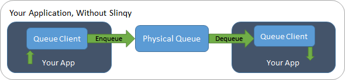
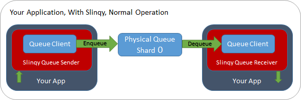
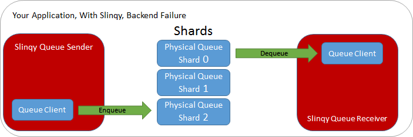
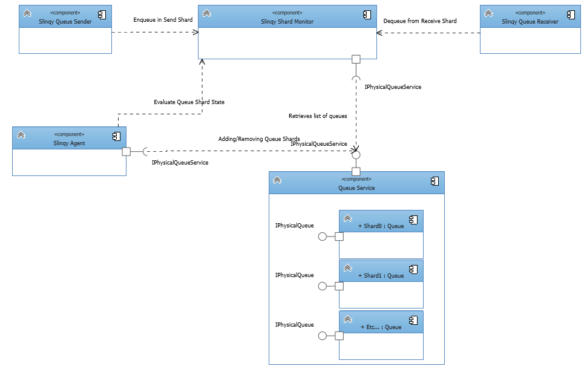

# What is Slinqy?
A tool for applications to automatically scale their queue resources at runtime based on demand.

[](https://ci.appveyor.com/project/rakutensf-malex/slinqy)
[](https://coveralls.io/github/stealthlab/slinqy?branch=master)

## 1 Overview

Slinqy is a library that simply wraps calls to your existing queuing infrastructure so that it can scale your queuing infrastructure for you, dynamically at runtime and transparently to your application.

### 1.1 Your Application, Without Slinqy


```csharp
YourCurrentQueueClient queueClient = QueueClient.CreateFromConnectionString(connectionString, queueName);

await queueClient.Send(message);
message = await queueClient.Receive();
etc...
```

### 1.1 Your Application, With Slinqy, Normal Operation


```csharp
IPhysicalQueueService physicalQueueService = new YourQueueServiceWrapper(connectionString);
SlinqyQueue           queueClient          = new SlinqyQueueClient(physicalQueueService).Get(queueName);

await queueClient.Send(message);
message = await queueClient.Receive();
etc...
```

## 2 Features
### 2.1 Auto Expanding Storage Capacity

During normal operation, your application will process queue messages in a timely fashion.

Unfortunately, issues can arise that prevent your back end from processing queue messages for prolonged periods of time.
Queues, high traffic queues in particular, can become full in such situations.  Either requiring frantic manual intervention or worse,
reaches full and the upstream users begin receiving errors...

Slinqy will automatically grow the storage capacity of your queue if utilization nears full so that you and your users never encounter queue full errors.

#### 2.1.1 How It Works

A Slinqy queue is a virtual queue that can be made up of one or more physical queue shards.

Under normal circumstances, Slinqy will only use one queue shard.  But if queue storage utilization reaches or exceeds the threshold you configure then Slinqy will automatically add additional queue shards to accommodate, which will be seamless to your application.

Slinqy will always send new messages to the highest physical queue shard and always read from the lowest physical queue shard to maintain the order of your messages.

##### Your Application, With Slinqy, Prolonged Backend Failure


### 2.2 Not Tightly Coupled to Any Queuing Technology

The core logic of Slinqy is not written against any particular queuing technology.  This provides several benefits:

1. You won't be waiting on us to integrate the latest and greatest of your particular queuing tools in to Slinqy.
2. No waiting or being held to older versions of your queuing tools.
3. Can work with any queuing technology.

#### 2.2.1 How It Works

Slinqy works against a set of interfaces that you implement.  Since you provide the queue technology specific implementation, it can be anything!

## 3 How to Use Slinqy

### 3.1 Get Slinqy
Slinqy is currently only available in source form from this repository.  It will soon be available via NuGet.
### 3.2 Implement Interfaces
[IPhysicalQueueService](Source/Slinqy.Core/IPhysicalQueueService.cs): The interface that allows Slinqy to manage your queuing technology of choice.

[IPhysicalQueue](Source/Slinqy.Core/IPhysicalQueue.cs): The interface that allows Slinqy to send and receive messages.
### 3.3 Integrate
#### 3.3.1 Sending Queue Messages
#### 3.3.2 Receiving Queue Messages
#### 3.3.3 Scaling

## 4 Design

### 4.1 Slinqy Components & Dependencies



#### Slinqy Queue Sender

Enqueues your messages.  At least one instance per queue *per application process* is required.  This is the only component that sends messages to the queue.

#### Slinqy Queue Receiver

Dequeues messages for processing.  At least one instance per queue *per application process* is required.  This is the only component that receives messages from the queue.

#### Slinqy Shard Monitor

Periodically pulls the current status of the shards from your queue infrastructure, typically shared by multiple components.  One instance per queue *per application process* is required.  This is the only component that polls the state of the physical queues.

#### Slinqy Agent

Periodically evaluates the shards and performs scaling actions if necessary.  One instance per queue *per application* is required.  This is the only autonomous component that manipulates your queue infrastructure.